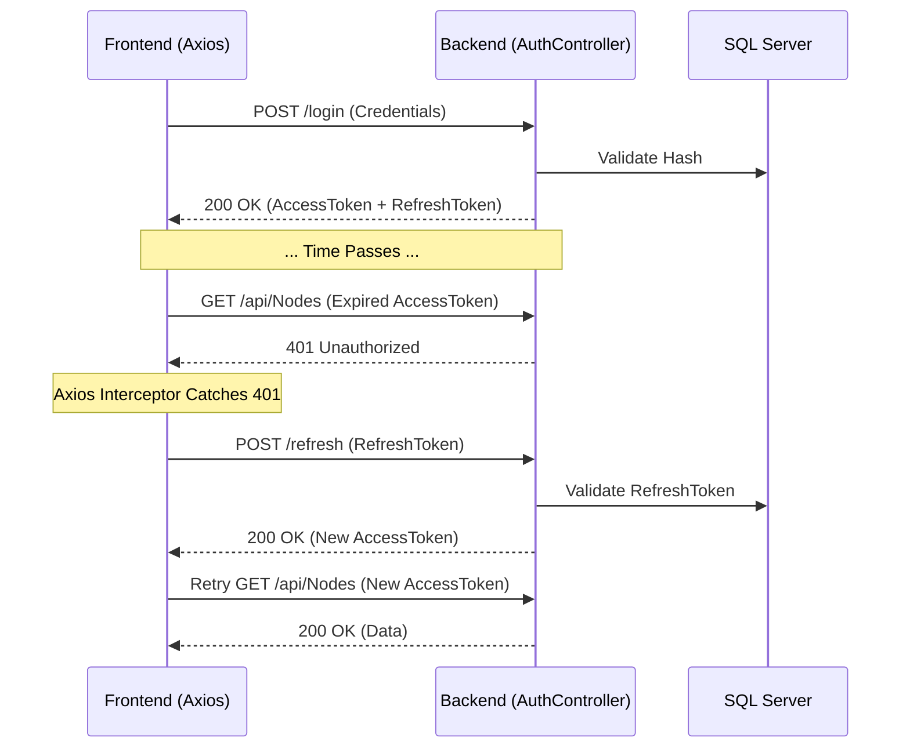

# Authentication & Axios Interceptor Lifecycle

## Purpose
NetRoute uses a stateless, highly secure JWT (JSON Web Token) authentication system combined with long-lived refresh tokens. This document explains how the frontend and backend communicate securely without forcing the user to log in repeatedly.

## Authentication Flow

## The Axios Interceptor
Located in `src/api/axiosInstance.ts`, the interceptor acts as the nervous system for all API requests.

### Request Interceptor
Before any request leaves the browser, the interceptor checks local storage for a JWT token. If present, it forcefully injects it into the `Authorization: Bearer <token>` header.

### Response Interceptor
If an API request fails with a `401 Unauthorized` status, it usually means the Access Token expired (they only last 60 minutes).
1. The interceptor catches the 401 error.
2. It checks a custom flag `_retry` on the original request to prevent infinite loops.
3. It pauses the failed request and calls `POST /api/Auth/refresh` using the Refresh Token.
4. If successful, it updates Local Storage with the new token.
5. It then *re-executes* the original failed request silently. The user never notices.
6. If the refresh fails (e.g., refresh token expired or revoked), it forcefully logs the user out.

## Session Restore (/api/Auth/me)
**Problem:** Pressing F5 (refreshing the page) cleared the React `AuthContext` state, booting the user back to the login screen despite having valid tokens in storage.
**Solution:** We implemented a `GET /api/Auth/me` endpoint. On application mount, the `AuthContext` makes a silent request to this endpoint. Because the Axios interceptor handles the token injection, if the token is valid, the backend returns the user profile, and React seamlessly restores the session state.
