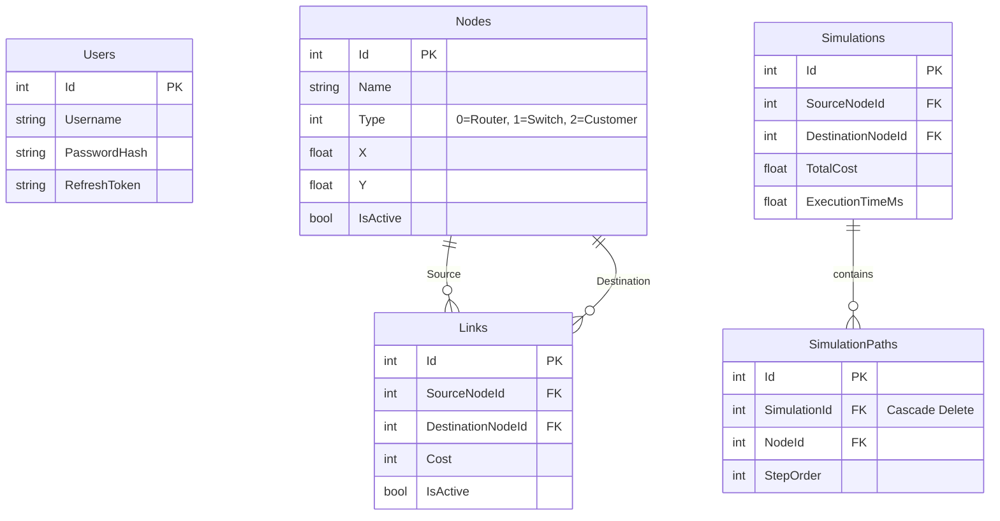

# Database Design

## Purpose
This document outlines the Entity Framework Core database schema and relational design that powers the NetRoute system.

## Entity Relationship Diagram (ERD)

## Important Design Decisions & Edge Cases

### The Cyclic JSON Serialization Issue
**Problem:** `Simulation` contains a list of `PathNodes` (`SimulationPath` objects). Each `SimulationPath` contains a back-reference to its parent `Simulation`. When ASP.NET attempted to return a Simulation to the frontend, it resulted in `System.Text.Json.JsonException: A possible object cycle was detected.`
**Solution:** We added `[JsonIgnore]` to the `Simulation` property inside the `SimulationPath.cs` model. This completely severs the infinite JSON serialization loop while preserving the fully-functional EF Core navigation property for C# queries.

### Foreign Key Constraint Crashes (Cascade Delete)
**Problem:** Originally, attempting to delete a `Simulation` crashed the backend with a 500 Internal Server Error due to a foreign key violation. The database prevented deletion because child `SimulationPaths` still referenced the parent ID.
**Solution:** We introduced a specific EF Core Migration (`AddSimulationPathCascadeDelete`) that modified the `OnDelete` behavior in the `AppDbContext`. Now, deleting a Simulation automatically cascades down and purges all associated paths at the SQL engine level.

### Link Foreign Keys
`Links` have two foreign keys pointing to the same `Nodes` table (`SourceNodeId` and `DestinationNodeId`). This requires explicit mapping in the `DbContext` to prevent multiple cascade paths, which SQL Server rejects by default. We disabled cascade deletes for Links, meaning deleting a Node requires manual deletion of its connected Links (handled in the `NodesController`).
