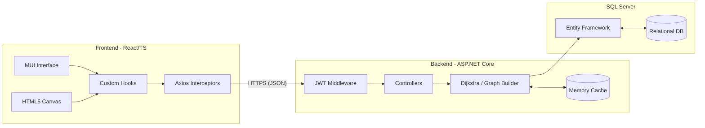
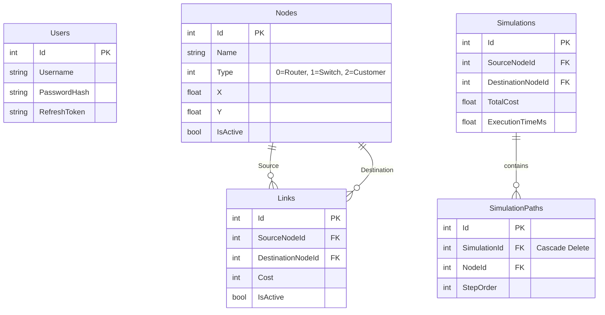
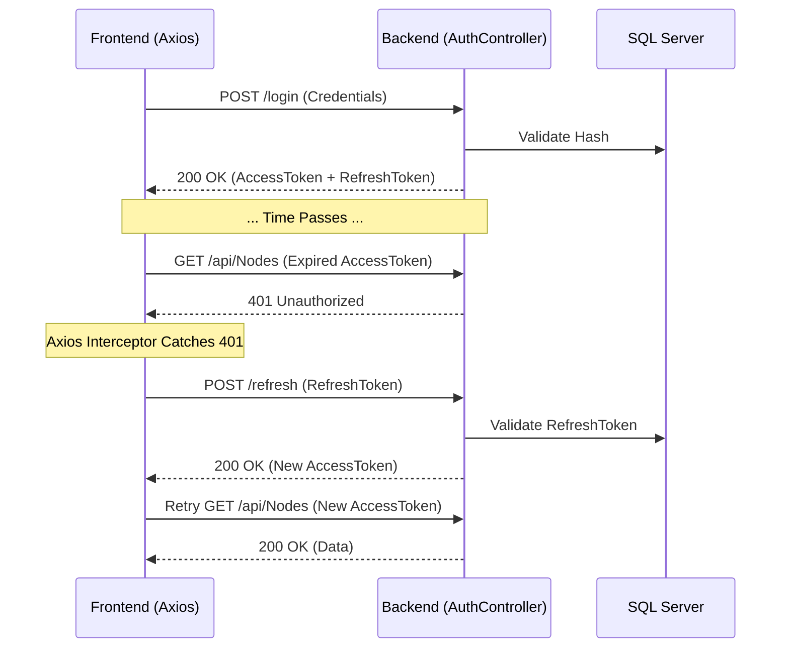

# Slide 1: Title Slide

**NetRoute**
*Advanced Network Routing Simulator*

**Capstone Engineering Defense**

**Presented By:** [Your Name]
**Role:** Lead Software Engineer

---

# Slide 2: Project Overview

**What is NetRoute?**
A full-stack, enterprise-grade web application designed to simulate computer network routing, visualizing topologies, and calculating shortest paths using graph algorithms.

**Core Capabilities:**
- Real-time interactive network topology mapping
- CRUD operations for network infrastructure (Nodes, Links)
- Mathematical routing simulation (Dijkstra's Algorithm)
- Session persistence via secure JWT architecture
- High-performance Canvas rendering for visualization

---

# Slide 3: Problem Statement

**The Challenge:**
Understanding complex network topologies and routing protocols requires visualizing abstract graph theory concepts in real-time.

**Technical Requirements:**
- **State Management:** Maintaining synchronization between a dynamic frontend UI and relational backend.
- **Algorithmic Complexity:** Executing $O(V^2)$ or $O(E + V \log V)$ pathfinding algorithms efficiently on web requests.
- **Performance:** Rendering large node/link graphs without DOM lag.
- **Security:** Ensuring stateless but persistent authentication.

---

# Slide 4: Technologies Used

**Frontend Ecosystem**
- **Core:** React 18, TypeScript, Vite
- **State & Data:** Context API, Axios (Interceptors)
- **UI & Graphics:** Material UI (MUI v5), HTML5 Canvas

**Backend Ecosystem**
- **Core:** ASP.NET Core 8 Web API, C#
- **ORM & DB:** Entity Framework Core, SQL Server
- **Security:** JWT Authentication
- **Performance:** IMemoryCache (In-memory graph caching)

---

# Slide 5: High-Level System Architecture



---

# Slide 6: Frontend Architecture

**Component-Driven Architecture**
- **Context Layer:** `AuthContext` manages global authentication state.
- **Hook Layer:** `useNodes`, `useLinks`, `useRouting` abstract API calls and manage loading/error states.
- **Service Layer:** `axiosInstance.ts` handles the nervous system of requests, injecting tokens and intercepting 401s.
- **Presentation Layer:** Highly modularized feature folders (`/auth`, `/dashboard`, `/network`, `/routing`).

*Design Decision:* Abstracting API calls into custom hooks prevents UI components from tightly coupling to backend endpoints, allowing seamless caching and error handling.

---

# Slide 7: Backend Architecture

**N-Tier Application Design**
- **Controllers:** Thin entry points (`RoutingController`, `NodesController`). Responsible ONLY for HTTP routing and DTO validation.
- **Services:** Fat logic layer (`DijkstraService`, `GraphBuilderService`). Contains all algorithmic and business logic.
- **Data Access:** Entity Framework `AppDbContext`.

*Design Decision:* Separating `GraphBuilderService` from `DijkstraService` allows us to cache the mathematical graph representation independently of the pathfinding execution.

---

# Slide 8: Database Design (ERD)



---

# Slide 9: Authentication System

**Stateless yet Persistent**
- **Access Token:** Short-lived (e.g., 60 mins) JWT containing user identity. Sent via `Authorization: Bearer` header.
- **Refresh Token:** Long-lived secure string stored in the database and HTTP-only cookie/local storage.
- **Endpoint Protection:** `[Authorize]` attribute secures backend controllers, decoding claims via .NET Middleware.
- **Session Restore:** `/api/Auth/me` validates existing tokens on application startup to restore React state.

---

# Slide 10: JWT + Refresh Token Flow



---

# Slide 11: Axios Interceptor Lifecycle

**The Nervous System of the Frontend**

```typescript
// Intercepting Responses
axiosInstance.interceptors.response.use(
  (response) => response,
  async (error) => {
    const originalRequest = error.config;
    // Catch exactly 401 Unauthorized, ensure we haven't retried yet
    if (error.response?.status === 401 && !originalRequest._retry) {
      originalRequest._retry = true;
      try {
        // Attempt token refresh silently
        const newToken = await refreshAuthToken();
        originalRequest.headers.Authorization = `Bearer ${newToken}`;
        // Re-execute original failed request
        return axiosInstance(originalRequest);
      } catch (refreshError) {
        // Refresh failed (e.g. expired refresh token) -> Force Logout
        forceLogout();
      }
    }
    return Promise.reject(error);
  }
);
```

---

# Slide 12: CRUD Architecture

**State Synchronization Strategy**
When modifying graph infrastructure (Nodes/Links), state must remain consistent across three layers:
1. React State (UI)
2. Backend Memory Cache (Graph representation)
3. SQL Server (Persistence)

*Flow:* User clicks "Delete Node" $\rightarrow$ React sends `DELETE /api/Nodes/5` $\rightarrow$ Backend deletes from SQL $\rightarrow$ Backend **Evicts Graph Cache** $\rightarrow$ React refetches list.

---

# Slide 13: Dijkstra Algorithm Explanation

**Objective:** Find the shortest path between a source node $S$ and a destination node $D$ in a weighted graph.

**Core Concepts in NetRoute:**
- **Graph:** Represented via an Adjacency List built by `GraphBuilderService`.
- **Weights:** Link `Cost` (simulating physical distance in meters).
- **Relaxation:** Updating the shortest known distance to a node.
- **Priority Queue:** Selecting the next unvisited node with the lowest tentative distance.

---

# Slide 14: Dijkstra Pseudo Code

```csharp
public Simulation RunDijkstra(int sourceId, int destId, Dictionary<int, List<Edge>> graph) 
{
    var distances = new Dictionary<int, double>();
    var previous = new Dictionary<int, int>();
    var priorityQueue = new PriorityQueue<int, double>();

    // Initialization
    foreach (var node in graph.Keys) distances[node] = double.MaxValue;
    distances[sourceId] = 0;
    priorityQueue.Enqueue(sourceId, 0);

    while (priorityQueue.Count > 0) {
        int current = priorityQueue.Dequeue();
        if (current == destId) break; // Reached target

        foreach (var edge in graph[current]) {
            double newDist = distances[current] + edge.Cost;
            if (newDist < distances[edge.TargetId]) { // Relaxation
                distances[edge.TargetId] = newDist;
                previous[edge.TargetId] = current;
                priorityQueue.Enqueue(edge.TargetId, newDist);
            }
        }
    }
    return BuildPath(previous, destId);
}
```

---

# Slide 15: Simulation System

**Persistence of Algorithm Execution**
Every routing request generates a `Simulation` entity.
- Tracks `TotalCost`, `ExecutionTimeMs`, `VisitedNodes`, and `EdgeRelaxations`.
- Linked to multiple `SimulationPath` entities representing the exact ordered steps.

*Why store this?*
Allows historical analysis of network routing efficiency over time, and serves as an audit log of graph traversal.

---

# Slide 16: Graph Cache System

**Mitigating Database Bottlenecks**
Building an Adjacency List from SQL requires iterating over all Nodes and Links. Doing this on every routing request is $O(N+E)$ database overhead.

**Solution:** `IMemoryCache`
- `GraphBuilderService` caches the graph topology for 30 minutes.
- **Cache Invalidation:** Any POST/PUT/DELETE to Nodes or Links controllers automatically calls `cache.Remove("NetworkGraph")`.
- **Result:** $O(1)$ memory access time during algorithm execution.

---

# Slide 17: Interactive Network Map

**Visualizing the Topology**
A standalone React feature (`NetworkMapPage`) using HTML5 `<canvas>`.
- **Rendering:** Avoids heavy DOM elements (like hundreds of SVG `<circle>` tags). Canvas handles 30+ nodes effortlessly.
- **Coordinate Mapping:** Transforms raw SQL $(x, y)$ coordinates to fit dynamic viewport dimensions.
- **Event Handling:** Mouse coordinates are inverse-transformed to detect hovers using Pythagorean distance $d = \sqrt{(x_2-x_1)^2 + (y_2-y_1)^2} \le Radius$.

---

# Slide 18: Canvas Rendering Flow

```mermaid
graph TD
    A[Component Mounts] --> B[ResizeObserver triggers]
    B --> C[Measure actual DOM viewport]
    C --> D[Calculate Min/Max DB Coordinates]
    D --> E[Compute dynamic Scale & Translation offsets]
    E --> F[requestAnimationFrame(draw)]
    F --> G[Clear Canvas]
    G --> H[Apply ctx.scale and ctx.translate]
    H --> I[Draw Links w/ Costs]
    I --> J[Draw Nodes w/ Labels]
    J --> K[Wait for Pan/Zoom/Hover Events]
    K -- "State updates" --> F
```

---

# Slide 19: Engineering Challenges (Part 1)

**Challenge 1: JSON Serialization Cycle Crash**
- **Bug:** `System.Text.Json.JsonException: A possible object cycle was detected.`
- **Root Cause:** `Simulation` contains `PathNodes`, which contain a back-reference to `Simulation`.
- **Solution:** Added `[JsonIgnore]` to navigation properties on the many-side to break the serialization loop without breaking EF Core queries.

**Challenge 2: React Runtime Layout Bug (Network Map)**
- **Bug:** Graph was rendering as a tiny, unreadable cluster in the corner.
- **Root Cause:** The component was artificially scaling DB coordinates to a hardcoded $800 \times 600$ box *before* applying viewport scaling.
- **Solution:** Rewrote coordinate logic to pass raw DB coordinates, relying entirely on a dynamic `fitScale` calculated by the `ResizeObserver` bounding box.

---

# Slide 20: Engineering Challenges (Part 2)

**Challenge 3: Database Foreign Key Restraint Violation**
- **Bug:** Deleting a Simulation crashed the API with a 500 Error.
- **Root Cause:** SQL Server prevented deletion because `SimulationPaths` still referenced the `SimulationId`.
- **Solution:** Added EF Core Fluent API migration: `OnDelete(DeleteBehavior.Cascade)` to `SimulationPath`.

**Challenge 4: Authentication State Loss on Refresh**
- **Bug:** Pressing F5 logged the user out of the frontend despite having a valid HTTP-only cookie / LocalStorage token.
- **Root Cause:** React Context state initializes as `null`.
- **Solution:** Implemented `/api/Auth/me` endpoint. On `AuthContext` mount, it automatically attempts to fetch the user profile. If successful, state is restored seamlessly.

---

# Slide 21: Performance Optimizations

1. **HiDPI Retina Canvas Scaling:**
   Multiplied canvas physical dimensions by `window.devicePixelRatio` and scaled the context. Fixes blurry text rendering on modern screens.
2. **Memory Caching:**
   Reduced DB hits for pathfinding from $100\%$ to $\approx 1\%$.
3. **Optimized Renders:**
   `NetworkGraph` utilizes `useRef` for tracking drag coordinates instead of `useState`, preventing costly React re-renders running at 60fps during mouse drag.

---

# Slide 22: Future Improvements

- **WebSockets / SignalR:** Real-time updates when another administrator modifies the network topology.
- **Additional Algorithms:** Implement Bellman-Ford or A* to compare execution times against Dijkstra.
- **Simulated Traffic Load:** Add dynamic "congestion" to link costs over time to observe route recalculation.
- **Dockerization:** Containerize the SQL DB, .NET Backend, and Vite Frontend into a single `docker-compose` cluster.

---

# Slide 23: Application Demo

*(Insert Screenshots Here)*

- **Dashboard:** System statistics overview
- **Nodes & Links:** CRUD interface
- **Network Map:** Full topology visualization
- **Routing:** Dijkstra execution and visual path highlighting
- **Simulations:** Historical data table

---

# Slide 24: Conclusion

**Project Summary:**
NetRoute successfully bridges complex graph theory algorithms with modern web technologies. 

By prioritizing clean architectural separation (N-Tier backend, Custom Hooks frontend), implementing robust caching, and rendering visualizations natively via Canvas, the application serves as a highly performant, scalable, and secure educational and analytical tool.

---

# Slide 25: Questions?

**Thank You!**

*Open for technical questions regarding architecture, algorithms, or implementation details.*
